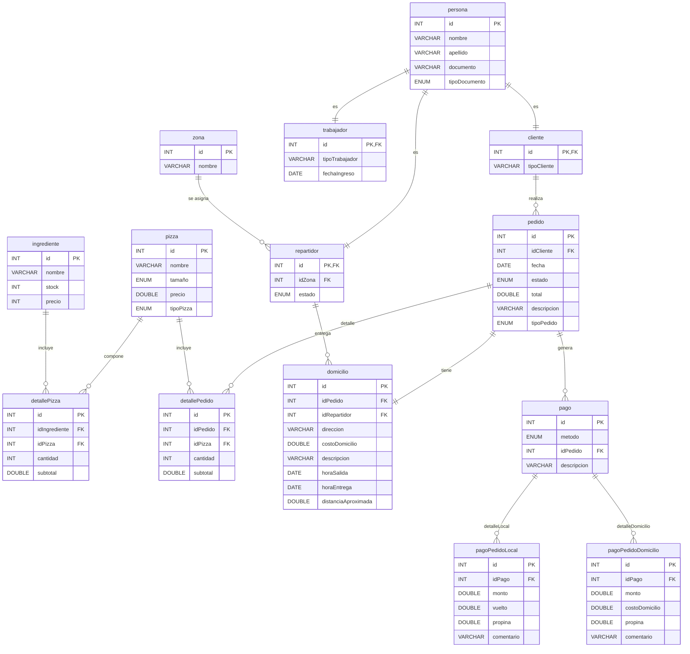

# Pizzería Don Piccolo – Base de Datos en MySQL

Este proyecto implementa una base de datos relacional diseñada para mejorar el control operativo de la pizzería Don Piccolo. El sistema permite gestionar pedidos, clientes, repartidores, inventario, pagos y procesos asociados a la entrega de domicilios, integrando funciones, triggers y vistas para optimizar las consultas y automatizar tareas críticas.

## Objetivo del Proyecto

Desarrollar una base de datos sólida, clara y funcional que centralice la información del negocio, automatice procesos comunes e integre mecanismos de control sobre inventario, pedidos y operaciones de entrega.

## Características Principales

- Registro y administración de clientes, repartidores, zonas y personal.
- Gestión de pizzas, ingredientes y composición de productos.
- Control de inventario mediante triggers automáticos.
- Registro completo de pedidos, detalles, pagos y domicilios.
- Funciones para cálculo del total de pedidos y ganancia neta diaria.
- Procedimiento para actualizar automáticamente el estado de los pedidos.
- Vistas de análisis operativo según los requerimientos del caso de estudio.

## Estructura de Archivos

```
pizzeriaPiccolo/
│
├── database.sql Script de creación de la base de datos, tablas e inserción de datos iniciales.
├── funciones.sql Funciones del sistema: cálculos de totales e indicadores.
├── triggers.sql Triggers para control de inventario y actualización de estados.
├── vistas.sql Vistas solicitadas en el caso de estudio.
├── consultas.sql Consultas avanzadas requeridas por el sistema.
└── README.md Documento de referencia del proyecto.
```


## Descripción del Caso de Estudio

La pizzería Don Piccolo opera con pedidos en local y a domicilio. Actualmente la gestión manual provoca retrasos y errores en registros de clientes y entregas. El objetivo del proyecto fue diseñar una base de datos que permita:

- Registrar clientes y su información de contacto.
- Manejar pizzas y la relación con sus ingredientes.
- Controlar stock de ingredientes y actualizarlo automáticamente con los pedidos.
- Registrar pedidos (local y domicilio), detalle de pizzas por pedido y pagos.
- Registrar domicilios con tiempos, distancias y costos de envío.
- Asignar repartidores por zona y medir su desempeño.
- Proveer funciones, triggers y vistas para consultas de negocio.

## Enfoque de la Solución

- **Modelado relacional:** Diseño de tablas normalizadas que representan personas (clientes, repartidores, trabajadores), pizzas, ingredientes, pedidos, domicilios y pagos.
- **Integridad referencial:** Claves primarias y foráneas para garantizar consistencia entre entidades.
- **Automatización:** Triggers para descontar stock y auditar cambios de precio; procedimiento y triggers para marcar pedidos como entregados; funciones para cálculo de totales y ganancias.
- **Reportes:** Vistas para resumir pedidos por cliente, desempeño de repartidores y stock bajo mínimo.
- **Datos de prueba:** Inserciones iniciales para permitir pruebas y consultas reales.

## Modelo Entidad-Relación (Mermaid)



# Vistas implementadas
## Vista: Resumen de pedidos por cliente

- **Campos:** nombre del cliente, cantidad de pedidos, total gastado.

- **SQL ejecutable:**
```
CREATE VIEW pedidoCliente AS
SELECT 
    c.id AS id_cliente,
    CONCAT(pers.nombre, ' ', pers.apellido) AS cliente,
    COUNT(p.id) AS cantidad_pedidos,
    IFNULL(SUM(p.total), 0) AS total_gastado
FROM cliente c
JOIN persona pers ON c.id = pers.id
LEFT JOIN pedido p ON p.idCliente = c.id
GROUP BY c.id, pers.nombre, pers.apellido;
```


### Vista: Desempeño de repartidores

- **Campos:** id repartidor, nombre, zona, número de entregas, tiempo promedio (minutos).  
- **SQL ejecutable:**
```
CREATE VIEW rendimientoRepartidor AS
SELECT 
    r.id AS id_repartidor,
    CONCAT(pers.nombre, ' ', pers.apellido) AS repartidor,
    z.nombre AS zona,
    COUNT(d.id) AS numero_entregas,
    ROUND(AVG(TIMESTAMPDIFF(MINUTE, d.horaSalida, d.horaEntrega)), 1) AS tiempo_promedio_min
FROM repartidor r
JOIN persona pers ON r.id = pers.id
JOIN zona z ON r.idZona = z.id
LEFT JOIN domicilio d ON d.idRepartidor = r.id
GROUP BY r.id, pers.nombre, pers.apellido, z.nombre;
```


### Vista: Ingredientes bajo el mínimo permitido

- **SQL ejecutable (umbral 20):**
```
CREATE VIEW ingredienteMinimo AS
SELECT 
    id,
    nombre,
    stock
FROM ingrediente
WHERE stock < 30;

```

## Funciones principales

### totalPedido(idPedido)

Calcula subtotal de pizzas (detallePedido), suma costo de domicilio (si existe) y aplica IVA (19%).


### gananciaNeta(fecha)

Calcula ventas del día menos el costo de ingredientes consumidos en las pizzas vendidas ese día.


## Procedimientos y triggers clave

### Procedimiento: actualizarPedido(idPedido)

Actualiza el estado del pedido a entregado si existe un domicilio con `horaEntrega`.


### - Trigger: Actualizar stock al insertar detallePedido


### - Trigger: Auditoría de precios de pizza


### - Trigger: Marcar repartidor disponible al terminar domicilio


## Consultas de ejemplo requeridas

- Clientes con pedidos entre dos fechas (`BETWEEN`).
- Pizzas más vendidas (`GROUP BY` y `COUNT`).
- Pedidos por repartidor (`JOIN`).
- Promedio de entrega por zona (`AVG` y `JOIN`).
- Clientes que gastaron más de X monto (`HAVING`).
- Búsqueda por coincidencia parcial de nombre de pizza (`LIKE`).
- Subconsulta para clientes frecuentes (>5 pedidos mensuales).


## Orden de ejecución recomendado

1. `database.sql` (crear base y tablas)  
2. `inserts.sql` (datos de prueba)  
3. `funciones.sql` (funciones)  
4. `triggers.sql` (triggers y tablas de auditoría)  
5. `vistas.sql` (vistas)  
6. `consultas.sql` (consultas y procedimientos adicionales)  

## Notas finales

- Ajusta el porcentaje de IVA y los umbrales de stock según la normativa local o la política del negocio.
- Si cambias la estructura de tablas, recuerda revisar y actualizar triggers, funciones y vistas que dependan de dichas columnas.
- Esta base de datos está pensada para integrarse con una capa de aplicación (web o móvil) que maneje la interacción con el usuario y la lógica de negocio adicional.
